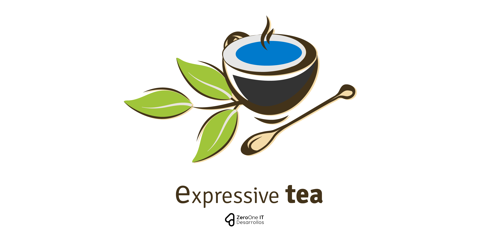

# Expressive Tea

> A Typescript library to create RESTful Services.

## Description
Expressive Tea is a simple library which allow to generate RESTful services with Typescript over Expressjs.

## Packages
* **Plugin:** A Plugin Engine to extend current projects with user flavored configurations and business logic.  

## Support
If you are experience any kind of issues we will be happy to help. You can report an issue using the [issues page](https://gitlab.com/zero-oneit/open-source/expressive-tea/issues) or the [chat](https://gitter.im/Zero-OneiT/expresive-tea). You can also ask questions at [Stack overflow](http://stackoverflow.com/tags/expressive-tea) using the `expressive-tea` tag.

If you want to share your thoughts with the development team or join us you will be able to do so using the [official the mailing list](https://groups.google.com/forum/#!forum/expressive-tea/). You can check out the
[wiki](https://github.com/Zero-OneiT/expresive-tea/blob/develop/README.md) to learn more about Expressive Tea internals or check our [documentation](https://zero-oneit.github.io/expresive-tea/).

## Contributing

Please read [CONTRIBUTING.md](CONTRIBUTING.md) for details on our code of conduct, and the process for submitting pull requests to us.

## Versioning

We use [SemVer](http://semver.org/) for versioning. For the versions available, see the [tags on this repository](https://gitlab.com/zero-oneit/open-source/expressive-tea/-/tags). 

## Authors

* **Diego Resendez** - *Initial work* - [zerooneit](https://github.com/zerooneit)

See also the list of [contributors](https://gitlab.com/zero-oneit/open-source/expressive-tea/-/graphs/master) who participated in this project.

## License

This project is licensed under the Apache-2.0 License - see the [LICENSE](LICENSE) file for details

## Disclaimers
The banner and the logo is a derivate work [Designed by Freepik](http://www.freepik.com)
