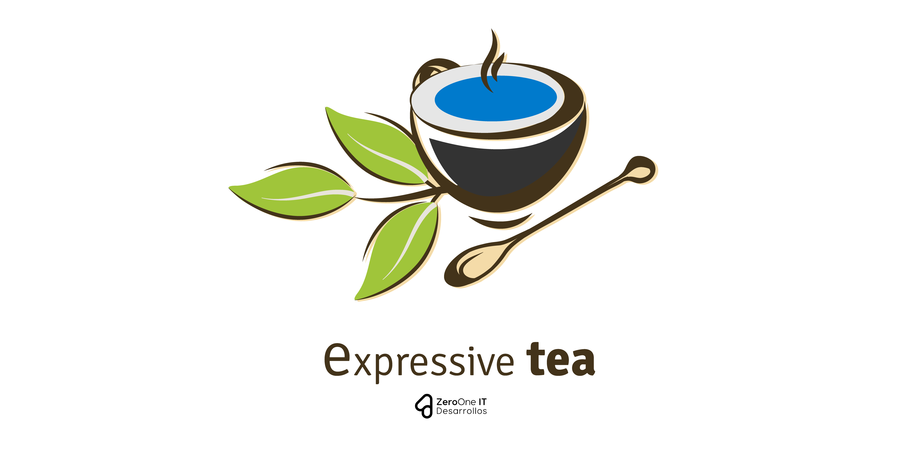

# Expressive Tea

> A Typescript Framework to create RESTful Services.

## Description
Allows to user create own recipes of their own configurations for Expressive Tea Projects which will helps to agilize and repeatable
patterns. In example: A User can make plugin configurations for a REST API projects and include all the express middlewwares and
configurations and make it reusable. Also allows users shares their best flavored settings for new projects.

> This Package is only **COMPATIBLE** with **`Expressive Tea >= 1.1.x`**
>
## Installation
```bash
$ npm install @expressive-tea/plugin
```

## Usage
Create a new file import the `Plugin` **class** and the **[Boot Stages](https://github.com/Zero-OneiT/expresive-tea#boot-stages)**
as is showing in the next example:

```typescript
import { Plugin, BOOT_STAGES } from "@expressive-tea/plugin"
import { Stage } from "@expressive-tea/plugin/decorators"
import { Express } from "express"

export default class PluginTest extends Plugin {
	protected name: string = "Plugin Test"
	protected priority: number = 100
	protected dependencies: string[] = []

	@Stage(BOOT_STAGES.BOOT_DEPENDENCIES)
	test(server: Express) {
		server.use((req, res, next) => {
			console.log("TEST from Plugin")
			next()
		})
	}

	@Stage(BOOT_STAGES.APPLICATION)
	secondTest(server: Express) {
		server.use((req, res, next) => {
			console.log("SECOND TEST from Plugin")
			next()
		})
	}
}
```

Then in the file where you have setting up your Expressive Tea project you need to use the `Pour` decorator and made an instance of your
plugin to attach it to current project.

```typescript
@ServerSettings({
	port: 8080
})
@Pour(new PluginTest())
class Bootstrap extends Boot {}
const bootstrap = new Bootstrap()
bootstrap.start()
``` 

## Documentation
### Abstract Class Plugin
Placeholder abstract class to allow define staged methods and main information.

#### Properties
| Modifier | Name  | Type  | Description |Default  |
|---|---|---|---|---|
| *Protected*  | **name**  | String | Defined the plugin name. | **Class Name**  |
| *Protected*  | **priority**  | Number | Defined Priority order. | 999  |
| *Protected*  | **dependencies**  | String[]| Defined Plugin Dependencies.  | []  |

```typescript
abstract class Plugin {
    readonly settings: ExpressiveTeaPluginSettings;
    protected name: string;
    protected priority: number;
    protected dependencies: string[];
    private static isDependencyRegistered;
    constructor(settings?: ExpressiveTeaPluginSettings);
    getRegisteredStage(stage: BOOT_STAGES): any;
}
```

### Stage Method Decorator
Define a Method that will be run it on a Expressive Tea defined **[Boot Stages](https://github.com/Zero-OneiT/expresive-tea#boot-stages)**.
```typescript
@Stage(stage: BOOT_STAGES, required?: Boolean): (target: any, propertyKey: any, descriptor: any) => void;
method(server: Express): void;
```

### Interfaces
```typescript
interface ExpressiveTeaServerProps {
    port?: number;
    [key: string]: any;
}

interface ExpressiveTeaPluginProps {
    name: string;
    priority: number;
}

interface ExpressiveTeaPluginSettings {
    priority?: number;
    name?: string;
    dependencies?: string[];
    [key: string]: any;
}

```
## Support
If you are experience any kind of issues we will be happy to help. You can report an issue using the [issues page](https://gitlab.com/zero-oneit/open-source/expressive-tea/issues) or the [chat](https://gitter.im/Zero-OneiT/expresive-tea). You can also ask questions at [Stack overflow](http://stackoverflow.com/tags/expressive-tea) using the `expressive-tea` tag.

If you want to share your thoughts with the development team or join us you will be able to do so using the [official the mailing list](https://groups.google.com/forum/#!forum/expressive-tea/). You can check out the
[wiki](https://github.com/Zero-OneiT/expresive-tea/blob/develop/README.md) to learn more about Expressive Tea internals or check our [documentation](https://zero-oneit.github.io/expresive-tea/).


## License

This project is licensed under the Apache-2.0 License - see the [LICENSE](LICENSE) file for details

## Disclaimers
The banner and the logo is a derivate work [Designed by Freepik](http://www.freepik.com)
